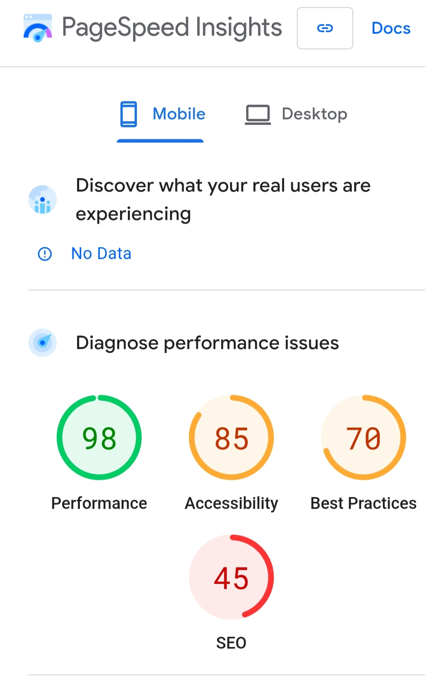
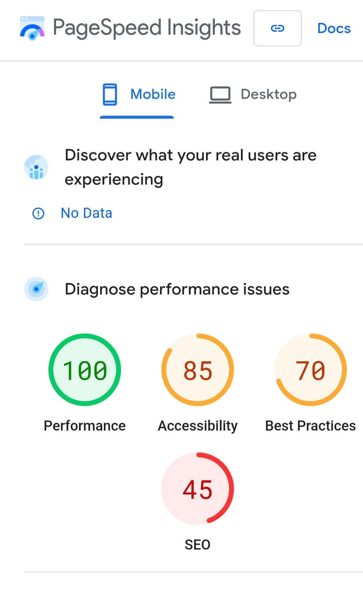

# Speed.js
  

Speed.js is a simple JavaScript file for HTML site to make it load faster.

# Prove

Before:

 

After:

# How to use it
You can use it by simply adding the speed.js to your site.

`script src="speed.js"`

# How it works?
Speed.js use WSM (WebsiteSpeedModule) to make website more faster

# Features
Here are all 50 features included in the `WebsiteSpeedModule` JavaScript module:

1. Load Script Dynamically
2. Load Stylesheet Dynamically
3. Minify Script
4. Minify CSS
5. Cache Resource
6. Get Cached Resource
7. Preconnect to Domain
8. Preload Resource
9. Lazy Load Images
10. Enable Browser Caching
11. Asynchronously Load Script
12. Defer Loading Script
13. Optimize Images
14. Optimize Fonts
15. Lazy Load Videos
16. Remove Unused CSS
17. Remove Unused JS
18. Prefetch Resource
19. Optimize Critical CSS
20. Lazy Load Background Images
21. Minimize Network Requests
22. Optimize XHR Requests
23. Optimize Third Party Scripts
24. Optimize Inline CSS
25. Lazy Load Iframes
26. Inline Critical CSS
27. Inline Small SVGs
28. Defer Non-Critical Scripts
29. Preload Fonts
30. Batch API Requests
31. Lazy Load Background Images (duplicate entry)
32. Preload Resources
33. Optimize Server Response Time
34. Compress Responses
35. Avoid Important Overrides
36. Reduce Global Variables
37. Use HTTP/2
38. Use WebP Images
39. Use Request Animation Frame
40. Implement Caching
41. Minimize DOM Manipulation
42. Avoid Blocking Scripts
43. Use Efficient Selectors
44. Use Efficient Data Structures
45. Optimize Server Response Time (duplicate entry)
46. Compress Responses (duplicate entry)
47. Avoid Important Overrides (duplicate entry)
48. Reduce Global Variables (duplicate entry)
49. Use HTTP/2 (duplicate entry)
50. Use WebP Images (duplicate entry)

**Made by Jose**
